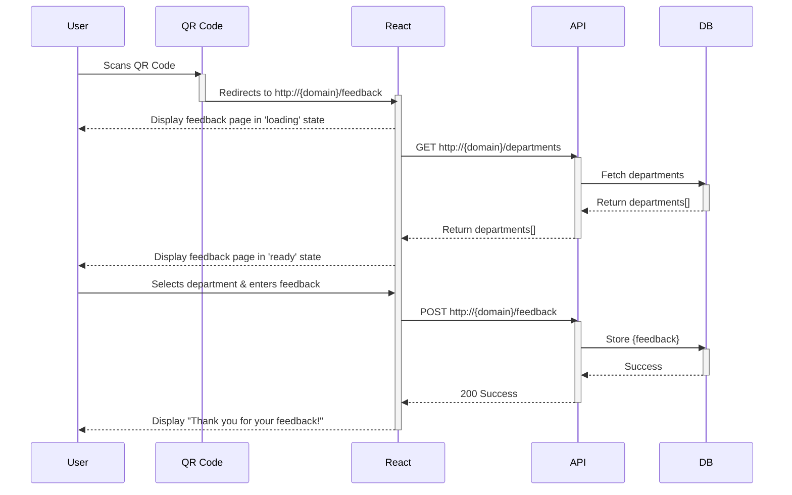

```mermaid
sequenceDiagram
    participant User
    participant QR Code
    participant React
    participant API
    participant DB

    User->>QR Code: Scans QR Code
    activate QR Code
    QR Code->>React: Redirects to http://{domain}/feedback
    activate React
    deactivate QR Code

    React-->>User: Display feedback page in 'loading' state
    React->>API: GET http://{domain}/departments
    activate API
    API->>DB: Fetch departments
    activate DB
    DB-->>API: Return departments[]
    deactivate DB
    API-->>React: Return departments[]
    deactivate API
    React-->>User: Display feedback page in 'ready' state

    User->>React: Selects department & enters feedback
    React->>API: POST http://{domain}/feedback
    activate API
    API->>DB: Store {feedback}
    activate DB
    DB-->>API: Success
    deactivate DB
    API-->>React: 200 Success
    deactivate API
    React-->>User: Display "Thank you for your feedback!"
    deactivate React
```
