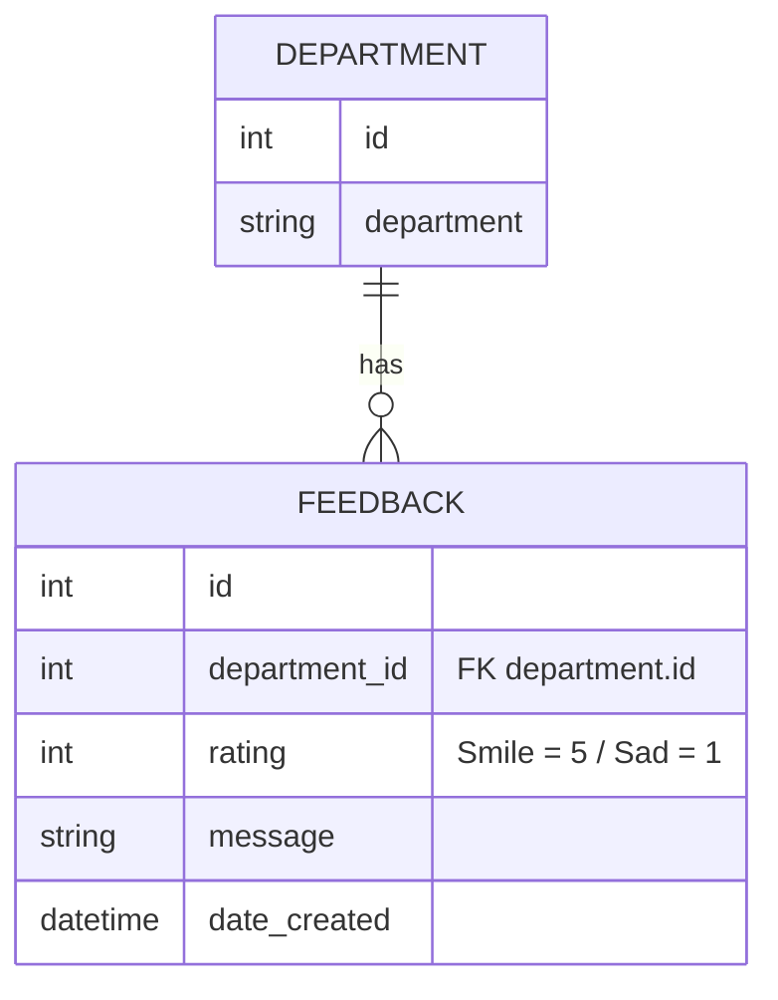

```mermaid
erDiagram
    "FEEDBACK" {
        int id
        int department_id "FK department.id"
        int rating "Smile = 5 / Sad = 1"
        string message
        datetime date_created
    }
    "DEPARTMENT" {
        int id
        string department
    }

    "DEPARTMENT"              ||--o{ "FEEDBACK": has
```
